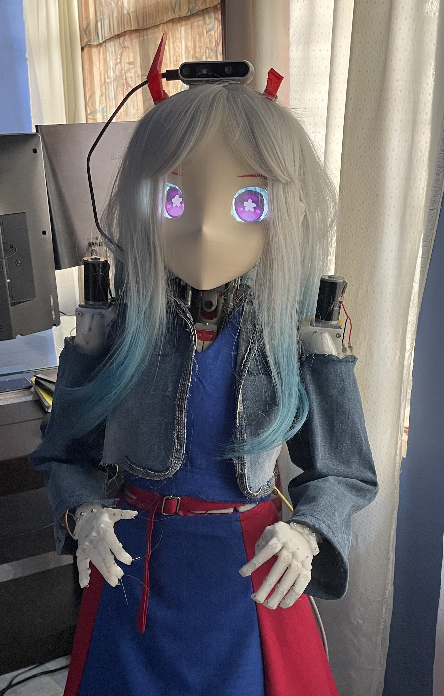

  

# Robótica impulsada por IA

En este proyecto se busca crear bases para proyectos de robótica con cuerpos humanoides impulsados con modelos generativos locales. Nuestro objetivo es apoyar a la comunidad dejando todo de código abierto y documentando todo lo necesario para replicarlo.

---

  

### Este proyecto es un conjunto de dos proyectos:

#### Proyecto DROIDE
Se busca crear la mejor calidad de hardware robótico humanoide, escalable y moldeable, dejando todo abierto para modificaciones.

#### Proyecto ABY
El Software que le dará vida al cuerpo robótico humanoide o personajes digitales. Se busca que sea lo más general posible para que se pueda usar en otros ámbitos; esto también da la oportunidad de reutilizar solo sus módulos de inteligencia en otros proyectos, como el módulo **ALMA3**.

---

### Próximamente

Muy pronto se estará subiendo todo el código del **Software ABY** para este diseño **DROID**. También se subirán todos los modelos `.stl` y archivos de Blender para imprimir, junto con la documentación e instrucciones importantes para replicarlo.

> Si este proyecto es bien recibido y apoyado, podremos crear la **versión 1.5**, donde se busca que sea más compacta, barata y con un diseño "todo en uno".

 

  

